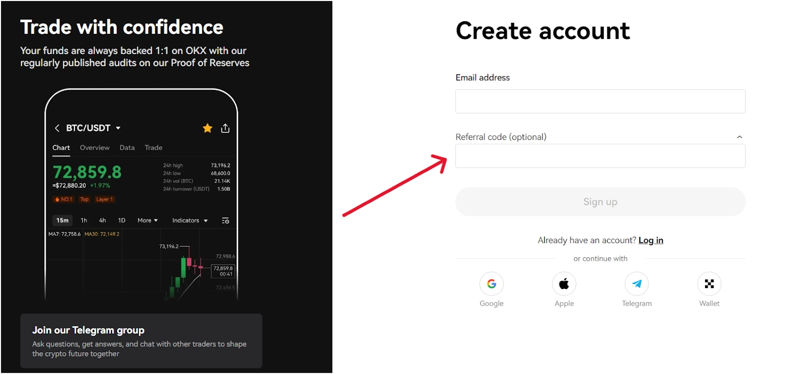
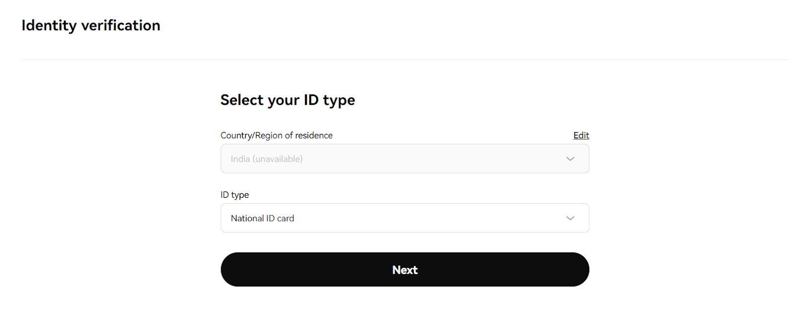
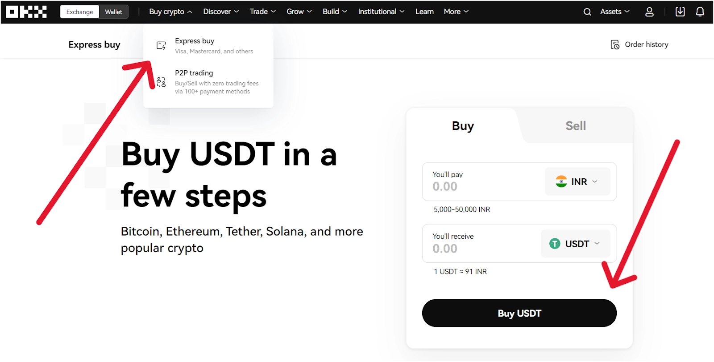
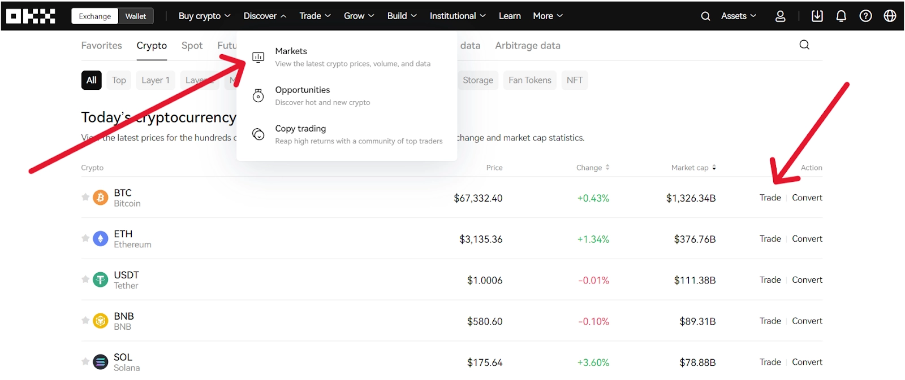
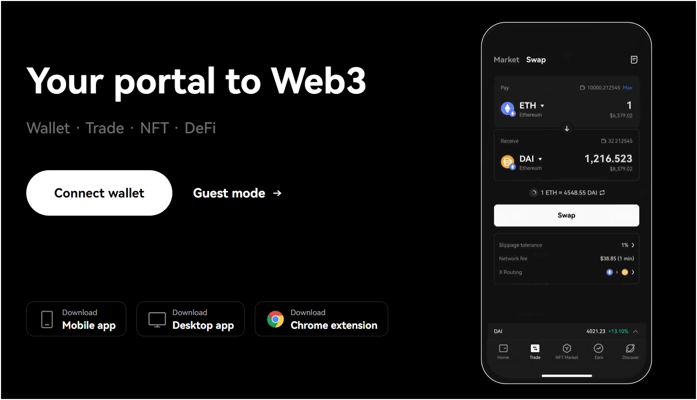
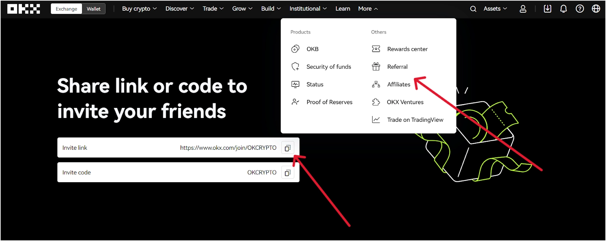

# OKX Referral Code: Unlock Up to $10,000 USDT Welcome Bonus

Look, I'm not going to pretend this is rocket science. You're here because you want to know how to get free crypto when signing up for OKX, right? Smart move. Using a referral code is basically like finding money on the sidewalk—except this money could be worth up to $10,000 USDT, plus some mystery boxes that might contain Bitcoin.

Here's the thing most people miss: crypto exchanges actually want to give you bonuses. They're competing for users, and that competition works in your favor. The OKX referral code **"47044926"** is your ticket to claiming those rewards. No tricks, no complicated hoops—just straightforward bonuses for getting started.

---

## What's Actually in the OKX Welcome Package?

When you use referral code "47044926" during signup, here's what you're getting:

**The Sign-Up Bonus**: Up to 10,000 USDT in rewards. Now, before you get too excited, you'll need to complete some tasks in the "Reward Center" to unlock this. Think of it as a treasure hunt, except the treasure is actual money.

**Mystery Boxes**: You can snag up to two mystery boxes, each containing up to $50 worth of USDT or Bitcoin. It's like those surprise eggs kids love, but instead of a cheap toy, you might get Bitcoin. Much better deal.

**Trading Fee Discount**: A 30% reduction on trading fees. This might not sound sexy, but if you're planning to trade regularly, this discount adds up faster than your coffee expenses.

The catch? You've got 30 days to open those mystery boxes, or they vanish like your New Year's resolutions. Don't let that happen.

---

## How to Actually Use the Referral Code (No BS Version)

**Step 1: Get to the OKX App**

Head over to the OKX website or download their app. Type "OKX" in Google, or better yet, 👉 [click here to start claiming your welcome bonus now](https://www.okx.com/join/47044926). Find the "Sign Up" button—usually hanging out in the top right corner, impossible to miss.

Enter your email and create a password. Make it strong, because losing access to a crypto account is about as fun as stepping on Legos barefoot.

Now comes the important part: In the "Referral Code" field, enter **47044926**. Don't skip this. Seriously. This is the difference between getting bonuses and leaving money on the table.

Complete the registration, verify your email, and you're in.

**Step 2: Prove You're Actually You (KYC Verification)**

Yeah, I know—nobody loves paperwork. But if you want those bonuses, OKX needs to verify your identity. It's a regulatory thing, not them being nosy.

Go to your profile, hit "Verification," and provide the basics: full name, birth date, where you live, government ID. For advanced verification, you'll need to upload a photo ID and take a selfie. Make sure the documents are clear—blurry photos won't cut it.

The verification usually takes a bit of time. Grab a coffee, check some memes, and wait for the approval notification.

**Step 3: Fund Your Account**

Time to put some money in. Navigate to the "Deposit" section under "Assets." OKX supports various cryptocurrencies and fiat currencies, plus different payment methods—bank transfers, credit cards (depending on your region), or peer-to-peer trading.

Pick whatever works for you and deposit at least $50 worth of crypto. This is the minimum to qualify for the welcome bonuses.

**Step 4: Make Your First Trade and Grab Those Bonuses**

Your account is funded—now it's time to trade. Browse the "Markets" section to find crypto pairs you're interested in (like BTC/USDT or ETH/USDT). Click "Trade" and choose whether you want to buy or sell.

You'll see two main order types:
- **Market Order**: Executes immediately at current market price
- **Limit Order**: You set the price, and the trade happens when the market hits your target

For your first trade, you need at least $50 worth of any accepted cryptocurrency to unlock the bonuses. Make that trade, then head straight to the "Reward Center" to claim your mystery boxes and track your rewards.

---

## Why OKX? (Beyond Just the Free Money)

OKX isn't just throwing bonuses around for fun. They've built a solid platform since 2017, now serving over 50 million users globally. They offer 331+ digital currencies and 553+ trading pairs—basically, if it's a legitimate crypto, they probably have it.

**Here's what makes OKX actually useful**:

- **Futures Trading**: Go up to 100x leverage if you're feeling adventurous (or reckless—your call)
- **Margin Trading**: Borrow funds to increase your buying power, up to 10x on BTC and ETH
- **Copy Trading**: Follow experienced traders if you're new to this whole crypto thing
- **P2P Trading**: Trade directly with other users using over 900 local payment methods
- **Trading Bots**: Automate your strategy with grid, DCA, and arbitrage bots
- **Earn and Staking**: Let your crypto work for you instead of sitting idle

The OKX Wallet is non-custodial, supporting multiple blockchains like Ethereum, BNB Smart Chain, and OKT Chain. It connects to the OKX DEX for decentralized trading and their NFT Marketplace for buying, selling, and creating NFTs.

---

## OKX Trading Fees (Actually Pretty Low)

OKX uses a tiered fee structure based on your 30-day trading volume and OKB holdings. For standard spot trading, maker fees are 0.08% and taker fees are 0.1%—below the industry average and way lower than exchanges like Coinbase.

Remember, using referral code **47044926** gets you an additional 30% discount on both spot and futures trading fees. Over time, this saves more than you'd think.

---

## Want to Earn Even More? The OKX Referral Program

Once you're set up, you can earn rewards by inviting others. When someone signs up using your referral link, you both get a $50 mystery box. Simple.

If you want to go bigger, check out the OKX Affiliate Program. It offers higher commission rates (up to 50% of referrals' trading fees), customizable campaigns, and marketing materials. 👉 [Start building your passive income with OKX referrals today](https://www.okx.com/join/47044926).

To get your own referral code:
- Log into your OKX account
- Navigate to the "Referral" section under "More"
- Generate your unique code or link
- Share it and track your earnings through the dashboard

---

## Is OKX Actually Safe?

Short answer: Yes.

OKX takes security seriously. They use cold wallets for offline storage (less risk than online wallets), maintain multiple backups in bank vaults, and have an asset risk reserve fund to protect user assets.

Two-factor authentication is mandatory—you can choose between SMS notifications or Google Authenticator. For deposits and withdrawals, they use semi-offline multi-signature mechanisms, with private keys stored in RAM instead of permanent memory for extra security.

They've been operating since 2017 without major security incidents, which in the crypto world is actually impressive.

---

## FAQs

**What's the best OKX referral code?**

The best current OKX referral code is **47044926**. It gives you access to up to $10,000 USDT in sign-up bonuses, mystery boxes worth up to $50, and a 30% trading fee discount.

**How do I get free Bitcoin on OKX?**

Sign up using referral code **47044926**, complete KYC verification, deposit at least $50, and make your first trade. Then claim your mystery boxes in the Reward Center—they might contain Bitcoin.

**Do mystery boxes really expire?**

Yes, you have 30 days to open them after receiving them. Set a reminder if you need to, because expired boxes are gone forever.

**Can I use OKX in the United States?**

OKX has restricted access in some regions due to regulations. Check their website for the most current list of supported countries.

**What if my mystery box doesn't appear?**

It can take up to 48 hours for mystery boxes to show up. If it's been longer than that, contact OKX customer service—they're usually pretty helpful.

**Is there a minimum deposit amount?**

To qualify for the welcome bonuses, you need to make a single transaction of at least $50 worth of any accepted cryptocurrency.

---

## Bottom Line

Using the OKX referral code **47044926** when signing up is one of those rare no-brainer decisions. You're getting started with up to $10,000 USDT in bonuses, potential Bitcoin in mystery boxes, and a 30% discount on trading fees. The platform itself is solid, secure, and offers enough features to grow with you as you learn more about crypto trading.

Don't overthink it—just sign up, enter the code, complete the tasks, and claim your rewards. Your future self will thank you, especially when you're sitting on those bonuses while others paid full price for the same experience. Start your crypto journey smart by claiming your OKX welcome package at [https://www.okx.com/join/47044926](https://www.okx.com/join/47044926).
